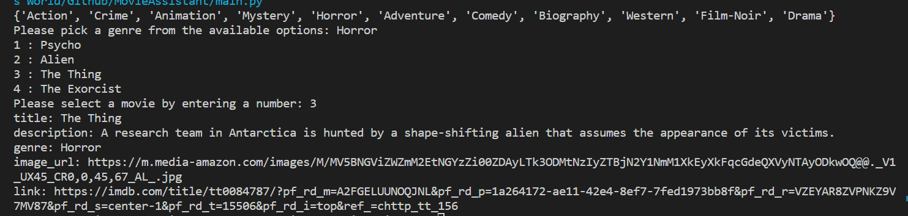

# MovieAssistant
A program that accesses a json file consisting of a list of movies. Allows the user to view the contents through filtering by genre and index.

## Requirements
- `Python 3.9x`

## Instructions
- Enter the preferred genre from a list
- Select the index for the corresponding movie you wish to view

